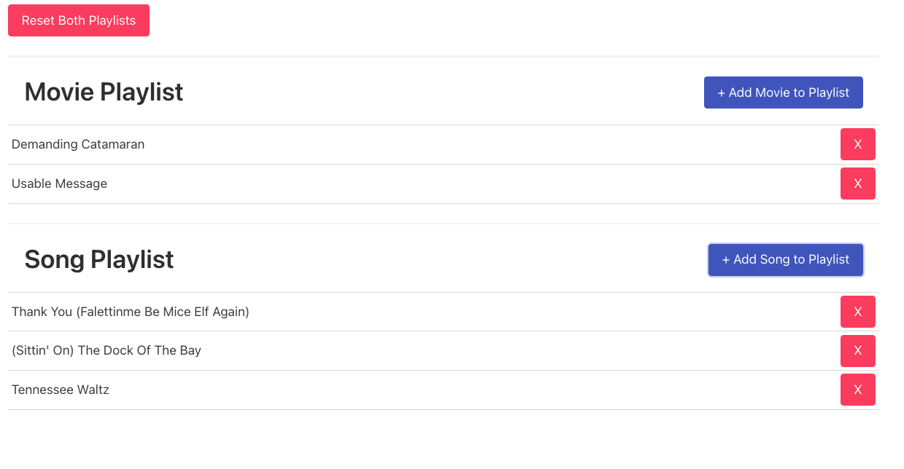

# React_Hobby_List

Repository created following this [Udemy Course](https://www.udemy.com/course/react-redux/) to practice the following basic React concepts:

- Redux

## Application

Application contains a couple of list for movies & songs. Whenever the user clicks on the 'Add' buttons, randomly generated songs / movies are added to the list. Red cross icons remove the items from the list. Last but not least, there is a button to reset both lists at the same time.

All this behaviour is handled with redux store.



## Run Locally

Clone the project

```bash
  git clone https://github.com/pedrolopezbiedma/React_Hobby_List.git
```

Install dependencies

```bash
  npm install
```

Start the application

```bash
  npm run start
```

## Authors

- [@pedrolopezbiedma](https://github.com/pedrolopezbiedma)
